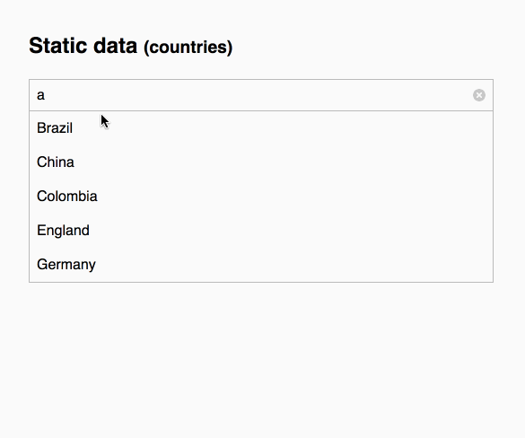

# Autocomplete

## Demo


## Setup
1. Clone this project
```
git clone git@github.com:ivanbanov/autocomplete.git
```

2. Install all dependencies
```
npm install
```

3. Run the dev server
```
npm start
```

Then access [http://localhost:8080/](http://localhost:8080/)

## Component properties

### data : <Array<string> | string> (required)
List of strings or url to get remote data

### value : string
Initial value of the input

### parseResults : Function
Parser function to serealize the remote data

### maxItems : number
Number of the maximum items to be shown

### onSelect : Function
Callback function for the select action


##  Technical specs
- **Styles**: StyledComponents
- **Tests**: Jest + Enzyme
- *Typesystem**: Flowtype
- **Lint**: ESlint
- **BuildTool**: Webpack

## Tasks
Compile and start the server on `http://localhost:3000/`
```
npm start
```

Run tests
```
npm test
```

Run the linters
```
npm run lint
```

